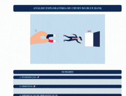
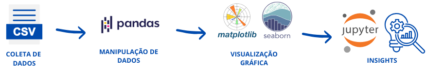
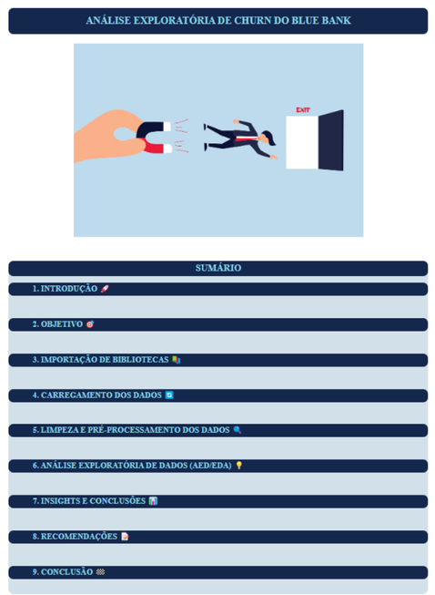
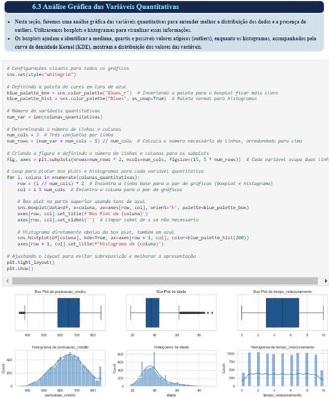
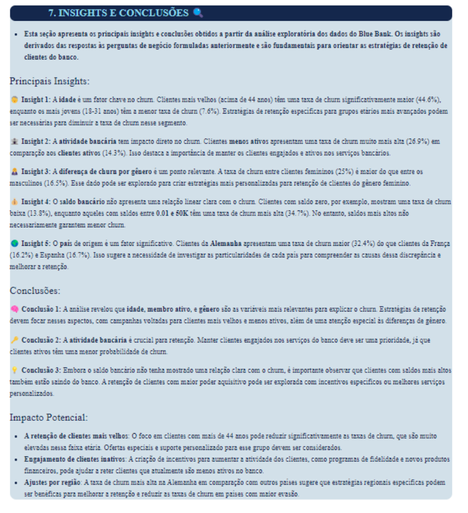

# 📊 Blue Bank Churn Analysis

## 📝 Descrição do Projeto  
O **Blue Bank Churn Analysis** é um projeto desenvolvido em Jupyter Notebook, realizado como parte do encerramento do módulo de **Técnicas de Programação** no curso **Santander Coders 2024**. O objetivo do projeto foi escolher um conjunto de dados e realizar uma Análise Exploratótia de Dados. Para isso, escolhemos um conjunto de dados realista e aplicamos uma **Análise Exploratória de Dados (EDA)** detalhada para identificar padrões em variáveis demográficas, financeiras e comportamentais para entender os fatores que contribuem para a rotatividade de clientes (*churn*) no Blue Bank.

Utilizando ferramentas como **Pandas**, **Matplotlib** e **Seaborn**, fomos capazes de visualizar e analisar as relações entre diversas características dos clientes, como idade, saldo bancário, gênero e atividade no banco, e determinar como essas variáveis influenciam a decisão dos clientes de permanecer ou sair da instituição.

Este projeto é um exemplo prático do poder da análise de dados para gerar insights valiosos, que podem ser usados pelo Blue Bank para melhorar suas estratégias de retenção de clientes e otimizar a tomada de decisões.

  

## 💾 Demonstração e Uso
Para explorar a análise, você pode seguir uma das opções abaixo:

1. **Visualização Direta no GitHub**:
   - Vá até a pasta **02-Analise** e abra o arquivo **Jupyter Notebook** diretamente no GitHub para visualizar a análise sem precisar baixar.
   - [Clique aqui para acessar a pasta de análise](02-Analise/blue-bank-costumer-churn-eda.ipynb).

2. **Download do Notebook**:
   - Caso a visualização no GitHub não funcione adequadamente ou prefira trabalhar localmente, você pode baixar o arquivo que está no caminho anterior.
   

3. **Instruções de Uso Local**:
   - Após baixar, abra o notebook no Jupyter ou em uma plataforma que suporte notebooks IPython.
   - Execute as células sequencialmente para visualizar as análises e gráficos.

## 🛠️ Tecnologias Utilizadas
- [Python](https://www.python.org/)
- [Jupyter Notebook](https://jupyter.org/)
- [Pandas](https://pandas.pydata.org/)
- [Matplotlib](https://matplotlib.org/)
- [Seaborn](https://seaborn.pydata.org/)

## 🏗️ Arquitetura e Fluxo de Dados

O fluxo de dados no projeto segue a seguinte estrutura:

- **Coleta de Dados**: O dataset foi carregado contendo informações detalhadas sobre os clientes, como idade, saldo bancário, atividade no banco e status de churn.
- **Manipulação de Dados**: Utilizamos a biblioteca Pandas para limpar, formatar e preparar os dados para análise.
- **Visualização Gráfica**: Aplicamos Matplotlib e Seaborn para criar visualizações que mostram padrões e correlações nas variáveis.
- **Geração de Insights**: A partir das visualizações e análises, identificamos fatores como idade avançada, saldo elevado e inatividade que influenciam diretamente o churn dos clientes.
- **Recomendações Estratégicas**: Com base nos insights, sugerimos ações para melhorar a retenção de clientes do Blue Bank.

## 🔄 Etapas do Projeto

1. **Preparação dos Dados**: Limpeza e formatação dos dados de churn, com foco na eliminação de valores nulos e inconsistentes.
2. **Análise Exploratória de Dados (EDA)**: Utilização de estatísticas descritivas e visualizações para entender o comportamento dos clientes e os fatores que influenciam o churn.
3. **Insights Obtidos**: Identificação dos principais fatores de churn, como idade avançada, inatividade e saldo elevado.
4. **Recomendações**: Sugestões de estratégias de retenção para grupos específicos de clientes com base nos insights.

## 📈 Impacto e Resultados

- **Decisões Baseadas em Dados**: A análise proporcionou insights concretos que podem guiar o Blue Bank a personalizar suas estratégias de retenção de clientes.
- **Melhor Entendimento do Churn**: Identificamos os fatores mais críticos que levam à saída de clientes, como idade, inatividade, localização, permitindo um foco mais estratégico em ações para retenção.
- **Aumento da Eficiência nas Decisões**: Com os resultados obtidos, o banco pode direcionar esforços para áreas que realmente influenciam o churn, aumentando a eficiência em suas estratégias de retenção.

## 🖼️ Screenshots
Aqui estão algumas capturas de tela das análises:

## 📞 Contato
- 📫 Você pode entrar em contato comigo pelo meu [e-mail](mailto:thiago.leit@hotmail.com).
- 💼 Meu perfil no [LinkedIn](https://www.linkedin.com/in/tnleite/) para acompanhar meu progresso e projetos.
- ✍🏻 Meu perfil no [Medium](https://medium.com/@thiago.leit) para ver artigos publicados.
- 🌐 Meu [Portfólio](https://thiagoleite.my.canva.site/) para visualizar outros projetos.

